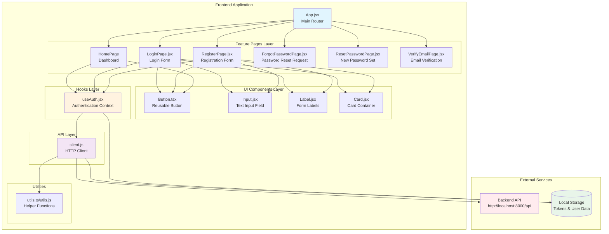
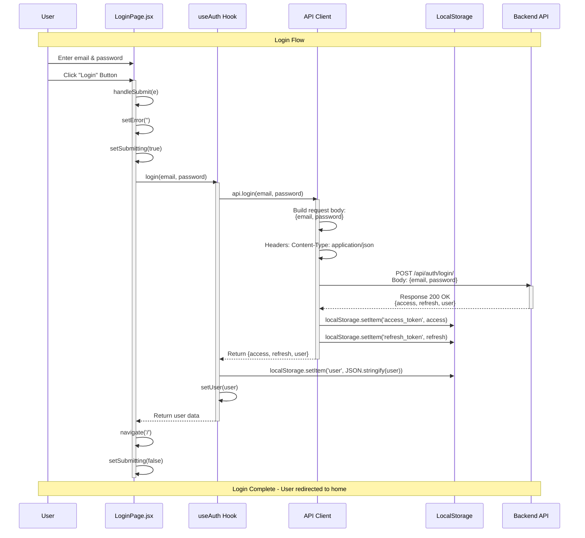
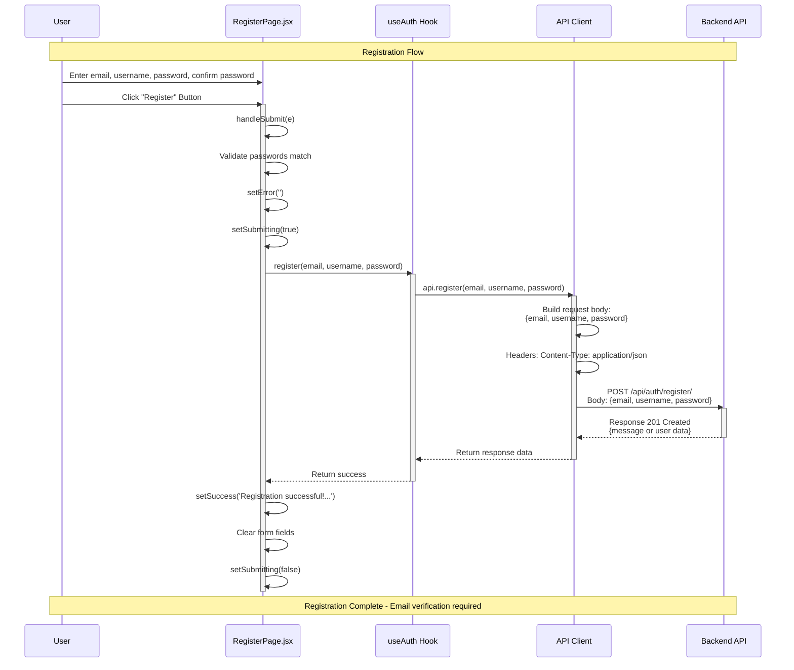
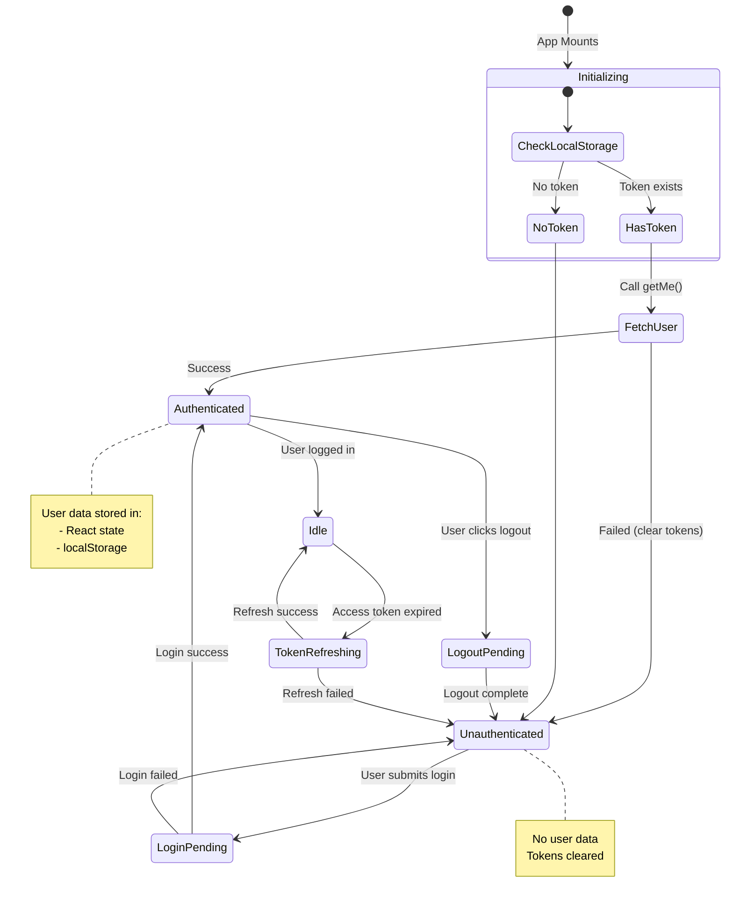
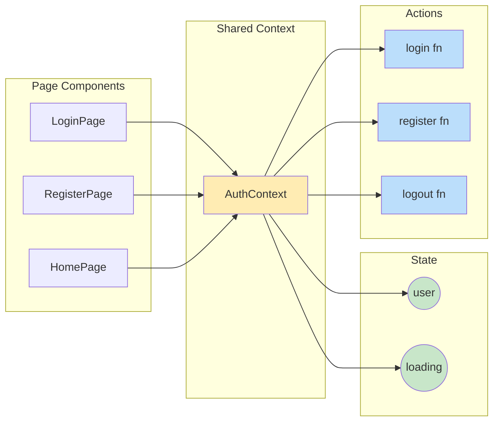
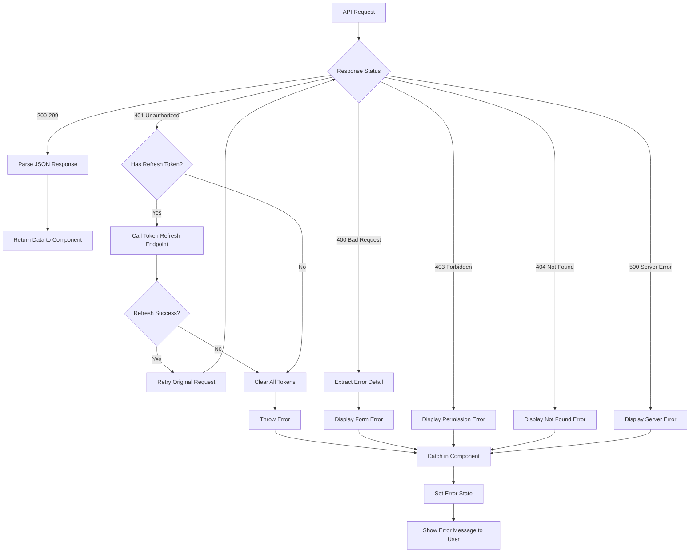

# Frontend Architecture & Scenario Diagrams

## 1. Component Architecture Diagram



---

## 2. Component Hierarchy Tree

```
App.jsx (Root)
│
├── BrowserRouter
│   └── Routes
│       ├── Route "/" → HomePage
│       │   ├── AuthProvider (Context)
│       │   │   └── useAuth Hook
│       │   ├── h1 "Social Network"
│       │   ├── Conditional Rendering
│       │   │   ├── IF user logged in:
│       │   │   │   ├── p (Welcome message)
│       │   │   │   ├── p (User email)
│       │   │   │   └── Button (Logout)
│       │   │   └── ELSE:
│       │   │       ├── Link → /login
│       │   │       │   └── Button (Login)
│       │   │       └── Link → /register
│       │   │           └── Button (Register)
│       │
│       ├── Route "/login" → LoginPage
│       │   ├── Card
│       │   │   ├── CardHeader
│       │   │   │   ├── CardTitle
│       │   │   │   └── CardDescription
│       │   │   ├── CardContent
│       │   │   │   └── Form
│       │   │   │       ├── Label (Email)
│       │   │   │       ├── Input (email)
│       │   │   │       ├── Label (Password)
│       │   │   │       ├── Input (password)
│       │   │   │       ├── Link (Forgot password)
│       │   │   │       ├── Error Message (conditional)
│       │   │   │       └── Button (Submit)
│       │   │   └── CardFooter
│       │   │       └── Link → /register
│       │   └── useAuth Hook
│       │
│       ├── Route "/register" → RegisterPage
│       │   ├── Card
│       │   │   ├── CardHeader
│       │   │   ├── CardContent
│       │   │   │   └── Form
│       │   │   │       ├── Input (email)
│       │   │   │       ├── Input (username)
│       │   │   │       ├── Input (password)
│       │   │   │       ├── Input (confirmPassword)
│       │   │   │       ├── Error/Success Messages
│       │   │   │       └── Button (Submit)
│       │   │   └── CardFooter
│       │   └── useAuth Hook
│       │
│       ├── Route "/forgot-password" → ForgotPasswordPage
│       ├── Route "/reset-password" → ResetPasswordPage
│       └── Route "/verify-email" → VerifyEmailPage
│
└── ProtectedRoute (Wrapper)
    └── Redirects to /login if not authenticated
```

---

## 3. Login Request/Return Flow Diagram



### Login Input Values Table

| Field | Type | Validation | Example Value |
|-------|------|------------|---------------|
| email | string | Required, valid email format | `user@example.com` |
| password | string | Required | `SecurePass123!` |

### Login Response Structure

```javascript
{
  access: "eyJhbGciOiJIUzI1NiIsInR5cCI6IkpXVCJ9...",
  refresh: "eyJhbGciOiJIUzI1NiIsInR5cCI6IkpXVCJ9...",
  user: {
    id: 1,
    email: "user@example.com",
    username: "john_doe"
  }
}
```

---

## 4. Registration Request/Return Flow Diagram



### Registration Input Values Table

| Field | Type | Validation | Example Value |
|-------|------|------------|---------------|
| email | string | Required, valid email format | `newuser@example.com` |
| username | string | Required | `john_doe` |
| password | string | Required, minLength: 8 | `SecurePass123!` |
| confirmPassword | string | Required, minLength: 8, must match password | `SecurePass123!` |

### Registration Request Body

```javascript
{
  email: "newuser@example.com",
  username: "john_doe",
  password: "SecurePass123!"
}
```

---

## 5. API Request Flow with Token Refresh

```mermaid
sequenceDiagram
    participant C as Component
    participant AH as useAuth
    participant AC as API Client
    participant LS as LocalStorage
    participant BE as Backend API

    Note over C,BE: Protected API Request with Auto Token Refresh

    C->>AC: request('/protected/endpoint')
    activate AC
    
    AC->>LS: getAccessToken()
    LS-->>AC: access_token
    
    AC->>AC: Add Authorization header:<br/>Bearer {access_token}
    AC->>BE: GET /api/protected/endpoint
    activate BE
    
    alt Token Expired (401)
        BE-->>AC: Response 401 Unauthorized
        deactivate BE
        
        AC->>AC: tryRefresh()
        AC->>LS: getRefreshToken()
        LS-->>AC: refresh_token
        
        AC->>BE: POST /api/auth/token/refresh/<br/>Body: {refresh: refresh_token}
        activate BE
        
        alt Refresh Successful
            BE-->>AC: Response 200<br/>{access, refresh}
            deactivate BE
            
            AC->>LS: setTokens(new_access, new_refresh)
            AC->>AC: Retry original request with new token
            AC->>BE: GET /api/protected/endpoint<br/>Bearer {new_access_token}
            activate BE
            BE-->>AC: Response 200 OK + Data
            deactivate BE
            BE-->>C: Return data
        else Refresh Failed
            BE-->>AC: Response 401/400
            deactivate BE
            AC->>LS: clearTokens()
            AC-->>C: Throw Error
        end
    else Token Valid
        BE-->>AC: Response 200 OK + Data
        deactivate BE
        AC-->>C: Return data
    end
    
    deactivate AC
```

---

## 6. State Management Flow (AuthProvider)



---

## 7. Component Communication Diagram



---

## 8. Error Handling Flow



---

## 9. File Structure Overview

```
frontend/
├── src/
│   ├── main.jsx                 # Entry point
│   ├── App.jsx                  # Main app with routing
│   │
│   ├── api/
│   │   └── client.js            # API client with auth handling
│   │
│   ├── components/
│   │   ├── ui/
│   │   │   ├── button.tsx       # Button component
│   │   │   ├── input.jsx        # Input component
│   │   │   ├── label.jsx        # Label component
│   │   │   ├── card.jsx         # Card components
│   │   │   └── toggle.jsx       # Toggle component
│   │   └── login_card.jsx       # Login card wrapper
│   │
│   ├── features/
│   │   └── auth/
│   │       ├── LoginPage.jsx
│   │       ├── RegisterPage.jsx
│   │       ├── ForgotPasswordPage.jsx
│   │       ├── ResetPasswordPage.jsx
│   │       └── VerifyEmailPage.jsx
│   │
│   ├── hooks/
│   │   └── useAuth.jsx          # Authentication context & hook
│   │
│   ├── lib/
│   │   ├── utils.ts             # Utility functions (TypeScript)
│   │   └── utils.js             # Utility functions (JavaScript)
│   │
│   └── utils/
│       └── utils.ts             # Additional utilities
│
├── package.json
├── vite.config.js
└── eslint.config.js
```

---

## 10. Key Component Props & Interfaces

### Button Component
```typescript
interface ButtonProps {
  variant?: 'default' | 'outline' | 'secondary' | 'ghost' | 'destructive' | 'link'
  size?: 'default' | 'xs' | 'sm' | 'lg' | 'icon' | 'icon-xs' | 'icon-sm' | 'icon-lg'
  className?: string
  asChild?: boolean
  disabled?: boolean
  onClick?: () => void
  type?: 'button' | 'submit' | 'reset'
}
```

### Input Component
```javascript
interface InputProps {
  type?: 'text' | 'email' | 'password' | 'number' | ...
  className?: string
  placeholder?: string
  value?: string
  onChange?: (e) => void
  required?: boolean
  disabled?: boolean
  // All standard HTML input attributes
}
```

### Card Components
```javascript
<Card size="default" | "sm">
  <CardHeader>
    <CardTitle>Title</CardTitle>
    <CardDescription>Description</CardDescription>
    <CardAction>Optional action</CardAction>
  </CardHeader>
  <CardContent>Content here</CardContent>
  <CardFooter>Footer content</CardFooter>
</Card>
```

---

## 11. Authentication State Transitions

| Current State | Action | New State | Side Effects |
|--------------|--------|-----------|--------------|
| Unauthenticated | Login Success | Authenticated | Store tokens & user in localStorage |
| Unauthenticated | Login Failed | Unauthenticated | Display error message |
| Authenticated | Logout | Unauthenticated | Clear tokens from localStorage |
| Authenticated | Token Expires | Refreshing | Auto-refresh token in background |
| Refreshing | Refresh Success | Authenticated | Update tokens in localStorage |
| Refreshing | Refresh Failed | Unauthenticated | Clear all tokens, redirect to login |
| Any | App Reload | Check localStorage | Restore session if valid tokens exist |

---

This documentation provides a comprehensive view of the frontend architecture, component relationships, data flow, and authentication scenarios.
